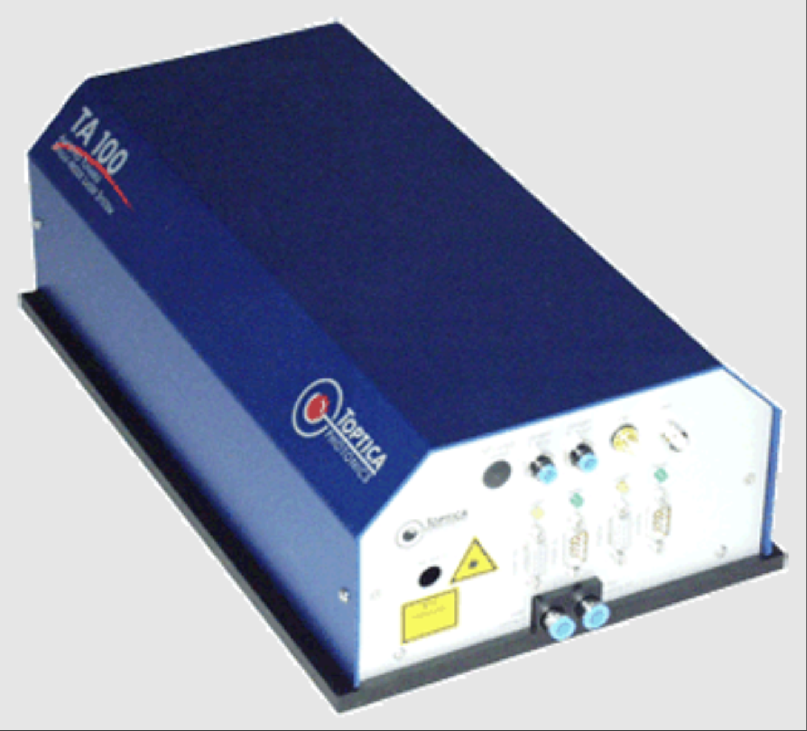
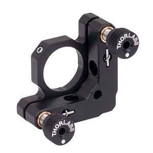
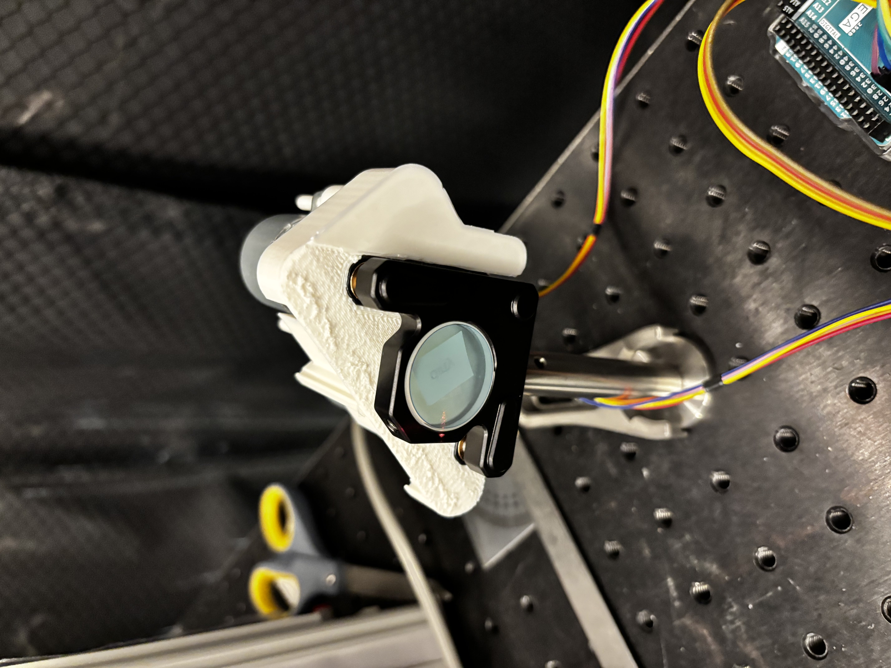
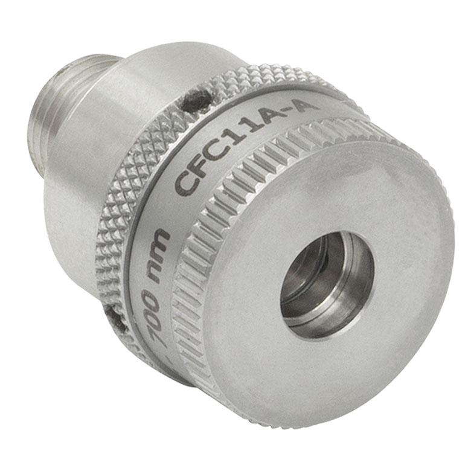
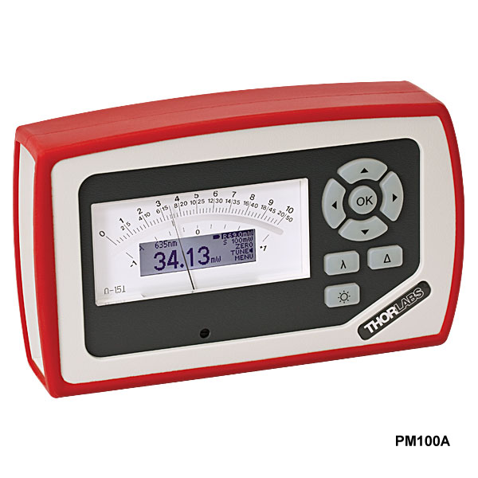

# Automatic-Laser-Alignment
## Introduction
This project implements an automated retrofitable laser alignment system designed to optimize optical coupling efficiency for optical setups in a general physics laboratory environment, such as experiments at the Duke Quantum Center.

Traditionally, coupling laser beams into fibers is a labor-intensive and manual process that can take hours and suffer from inconsistency. Furthermore, such an alignment is not permanent, and due to factors such as human error, addition of new components, or simply mechanical drift, alignment needs to be repeated constantly for a single laser path. Considering the large number of such paths for just a single experimental setup, the combined hours of labor are significant.

There exist solutions for this problem in the market, which are prepackaged motorized mirror mounts and controllers. However, these devices are expensive and are also entirely new parts that cannot be immediately applied to an existing optical path. Considering the sheer number of mirror mounts used in a system, the cost and hours necessary for setting these devices up become prohibitive.

We present a solution that is both inexpensive and retrofittable. Our solution automates a 4-axis alignment task using a Nelder-Mead optimization algorithm running on an Arduino Mega. By controlling motorized mirror mounts, the system achieves high-precision alignment in minutes with superior repeatability compared to manual methods.

## System Specifications
### Targeting accuracy goals:
-  Lateral error ≤ ± 250 μm
-  Angular error ≤ ± 5 mrad
### Performance goals:
-  System improves output power relative to misaligned start
-  Manual override available at any time
-  Typical alignment cycle completes within a few to tens of minutes
- System is easy to install onto the prexisting hardware
## Design Description
### Software Architecture

The core logic resides in `arduino_full.ino`, which implements the control loop and optimization algorithm.
- **Optimization Algorithm**: A custom C++ implementation of the **Nelder-Mead simplex method** (`nelderMead4D`). It optimizes a 4-dimensional space (X/Y axes for 2 mirrors) to maximize light intensity. One convenient part of this method is that it requires very little prior information. No gradients are used and the function is agnostic to the underlying intensity profile or motor identifiers.
- **Motor Control**: The `setMirrorPositions` function manages four `Stepper` objects (using the standard Arduino `Stepper.h` library). It handles coordinate tracking and sequential motor movement. Gear ratios and step sizes are defined in constants at the top of the file.
- **Sensor Interface**: The `measureIntensity` function reads the analog voltage from the photodetector (pin A0), averaging multiple samples (`ADC_SAMPLES`) to reduce noise.
- **Simulation Mode**: A `SIMULATED` flag allows testing the optimization logic without physical hardware by using a mathematical model of the laser intensity profile.

### Hardware Architecture
#### Pre-Existing Hardware Setup

The hardware setup for the automatic laser alignment system includes the following components.
- One laser source (Diode @760nm in TA100)

- Two 2-axis mirror mounts (K100) with installed mirrors

- One (mounted) collimator (CFC11A) and fiber

- One power meter (Thorlabs PM100A)

#### New Components
==TODO: Minseo please fill this out== 
The hardware setup consists of the following components:
- Four 2048-step stepper motors (28BYJ-48) to control two 2-axis mirrors TODO: include an image
- Four motor drivers (ULN2003)
- Two motor holding and guidance assemblies (designed, 3D print)
- Four motor-screw adaptors (designed, 3D print)
- One microcontroller board (Arduino Mega 2560) to control the stepper motors and read photodetector values TODO: include an image

#### Power and Networking
- The photodetector outputs an analog voltage proportional to the detected light intensity. This signal is transmitted to the Arduino Mega via analog input pin A0.
- The stepper motors communicate with the Arduino Mega through its corresponding motor driver board, which interprets and converts the control signal from the Arduino Mega. It also draws power to drive the motor.
- All power used in the new components comes from one 5V power supply from the wall. Total operating current does not exceed 2A for a 4-motor setup.
==TODO: Add flow chart== 

## Testing and Validation
### Targeting accuracy:
-  Lateral error ≤ ± 250 μm
-  Angular error ≤ ± 5 mrad

####  Theoretical Resolution
Based on the hardware specifications defined in the firmware (`arduino_full.ino`), we can calculate the theoretical mechanical resolution of the system.

*   **Stepper Motor**: 2048 steps per revolution (28BYJ-48).
*   **Mirror Mount Gearing**: 2 motor revolutions per 1 degree of mirror tilt (`REV_PER_DEGREE`).
*   **System Steps per Degree**: $2048 \times 2 = 4096$ steps/degree.

**Angular Resolution**:
$$ \theta_{res} = \frac{1}{4096} \approx 0.000244^\circ \approx 4.26 \mu\text{rad} $$

**Lateral Resolution**:
At a target distance of 50 cm, the theoretical beam displacement per step is:
$$ \Delta x = d \times \tan(\theta_{res}) \approx 500 \text{ mm} \times 4.26 \times 10^{-6} \approx 2.13 \mu\text{m} $$

#### Practical Demonstration
==TODO: Minseo please put the video results here== 
### Performance goals:
- [x]  System improves output power relative to misaligned start: We consistently observed a significant increase in detected intensity after running the alignment routine from various misaligned starting positions. The determinism of the stepper motors ensured non-decreasing performance across multiple trials & we achieved consistent improvements, comparable to human tuning.
- [x]  Manual override available at any time: System could be reset with a single button press on the Arduino Mega. During alignment, manual adjustments to the mirror mounts were possible without damaging the motors or losing system state. Additionally, all components went through a single 5V power supply, simplifying the wiring and making deactivation straightforward.
- [x]  Typical alignment cycle completes within a few to tens of minutes: Alignment convergence consistently in 1-3 minutes.
- [x]  System is easy to install onto the preexisting hardware: All components were either extremely common (Arduino Mega, 28BYJ-48 stepper motors) or 3d-printable. The entire system was assembled on a standard optical table using common mounting hardware (posts, post holders, breadboards). Our motor mount slid onto the K100 mirror mounts without modification and we would repeatably take the system on and off the optical table without issue during testing.

## Demonstration Videos
The demonstration videos showcasing the fully working system can be found in the assets/videos folder or should be attached in the email along with this document.

*Note that demo1.mp4 shows alignment with the laser has a high power setting
